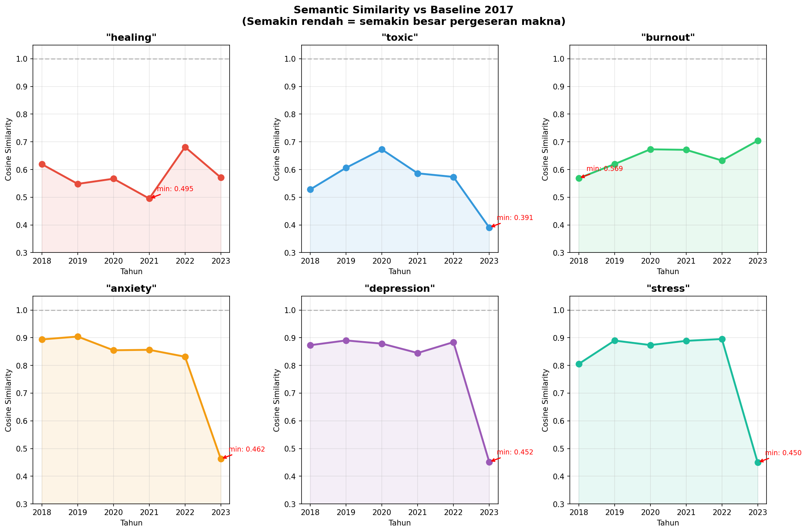
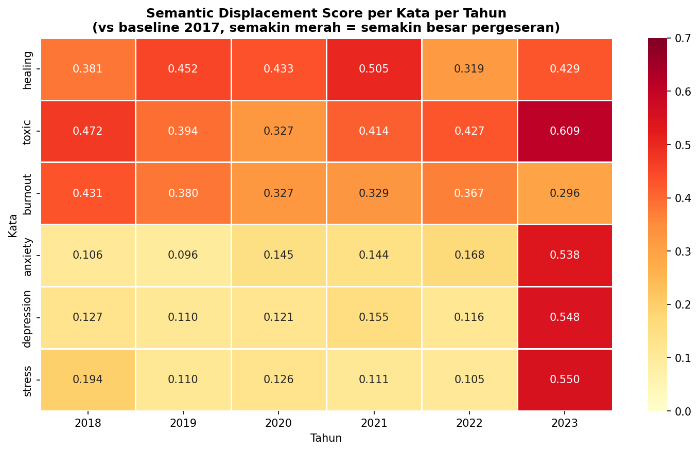
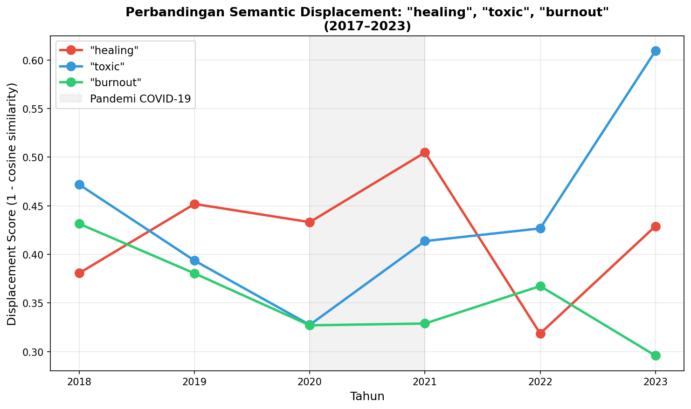
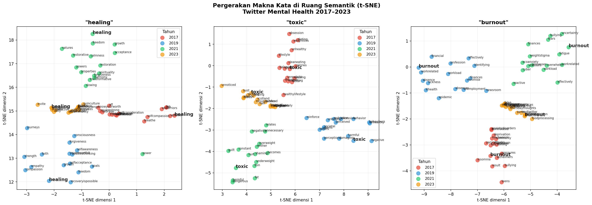

# 🧠 Diachronic Semantic Shift of Mental Health Terms on Twitter (2017–2023)

> Measuring semantic drift of mental health terminology on Twitter using diachronic Word2Vec embeddings and Procrustes alignment across 724K tweets (2017–2023)

[](https://python.org)
[](https://radimrehurek.com/gensim/)
[](LICENSE)

---

## 📋 Table of Contents

- [Overview](#overview)
- [Key Findings](#key-findings)
- [Results & Visualizations](#results--visualizations)
- [Dataset](#dataset)
- [Methodology](#methodology)
- [Project Structure](#project-structure)
- [How to Run](#how-to-run)
- [Tech Stack](#tech-stack)
- [References](#references)

---

## Overview

Mental health terminology has undergone significant semantic evolution on social media. Terms like _healing_, _toxic_, and _burnout_ are now used in contexts far removed from their clinical origins. This project **quantifies** that shift using:

- **Word2Vec** models trained independently per year (2017–2023)
- **Orthogonal Procrustes alignment** to anchor all models into a shared vector space
- **Cosine similarity** and **displacement scores** to numerically measure semantic change
- **t-SNE visualization** to show semantic movement in 2D space
- **Nearest neighbor analysis** to qualitatively interpret what each word "meant" per year

---

## Key Findings

### 📊 Displacement Score Table

_(vs Baseline 2017 — higher score = greater semantic shift)_

| Keyword     | 2018  | 2019  | 2020  | 2021  | 2022  | 2023  |    Level    |
| :---------- | :---: | :---: | :---: | :---: | :---: | :---: | :---------: |
| **healing** | 0.381 | 0.452 | 0.433 | 0.505 | 0.319 | 0.429 | 🟡 MODERATE |
| **toxic**   | 0.472 | 0.394 | 0.327 | 0.414 | 0.427 | 0.609 |   🔴 HIGH   |
| **burnout** | 0.431 | 0.380 | 0.327 | 0.329 | 0.367 | 0.296 |   🟢 LOW    |
| anxiety     | 0.106 | 0.096 | 0.145 | 0.144 | 0.168 | 0.538 |      —      |
| depression  | 0.127 | 0.110 | 0.121 | 0.155 | 0.116 | 0.548 |      —      |
| stress      | 0.194 | 0.110 | 0.126 | 0.111 | 0.105 | 0.550 |      —      |

### 🔍 Nearest Neighbors Shift

| Year | "healing"                                               | "toxic"                                   | "burnout"                                       |
| :--: | :------------------------------------------------------ | :---------------------------------------- | :---------------------------------------------- |
| 2017 | selflove, youareenough, selfworth, bebrave              | unhealthy, cleaneating, calories, dieting | panicattacks, chronicpain, insomnia, alzheimers |
| 2019 | recoveryispossible, growth, forgiveness, selfacceptance | norms, harmful, beliefs, societal         | workrelated, workload, absence, sickness        |
| 2021 | forgiveness, spirituality, acceptance, calmness         | fat, harmful, overweight, negativity      | fatigue, bullying, stressors, workload          |
| 2023 | collective, invite, timeforchange, community            | tackling, busting, advocacy, assumptions  | panic, socialanxiety, mentalhealthservices      |

### 💡 Interpretation

**🔴 "toxic" — Largest Shift (0.609)**

> Started in 2017 as diet/eating disorder language (`cleaneating`, `calories`, `restricting`). By 2019, it expanded to social norms discourse (`harmful`, `societal`). By 2023, it's firmly in advocacy/campaign territory (`tackling`, `busting`). This reflects the viral popularization of "toxic" as a general social criticism term far beyond its clinical origins.

**🟡 "healing" — Moderate Shift (0.429), COVID-19 Peak at 2021**

> In 2017: deeply personal, self-love motivated language (`selflove`, `youareenough`). By 2021 (pandemic peak): spiritual and communal (`forgiveness`, `spirituality`, `acceptance`). By 2023: community/event language (`collective`, `invite`, `timeforchange`). The pandemic appears to have collectivized what was once an individual journey.

**🟢 "burnout" — Most Stable (0.296)**

> Consistently tied to occupational health. Moved from clinical disorder context (2017) → workplace stress (2019–2021) → back to clinical in 2023. Aligns with WHO's formal recognition of burnout as an occupational phenomenon in 2019.

---

## Results & Visualizations

### 1. Semantic Similarity Over Time



Each subplot tracks how much one keyword's meaning drifted from its 2017 baseline, measured by cosine similarity of aligned word vectors. A value of **1.0** means identical context to 2017; lower values indicate semantic drift. The red annotation marks the year of maximum divergence per keyword. The gray band marks the COVID-19 pandemic period (2020–2021), which visibly coincides with inflection points — particularly for `healing` (peak drift at 2021: 0.495) and `toxic`.

---

### 2. Displacement Heatmap



A matrix view of displacement scores (`1 − cosine similarity`) for all 6 keywords across 2018–2023. **Darker red = greater semantic shift from 2017 baseline.** Key observations:

- `toxic` (2023) is the single hottest cell at **0.609** — the largest shift across all keywords and years
- `anxiety`, `depression`, and `stress` remain stable 2018–2022, then spike sharply in 2023 (~0.54), possibly reflecting post-pandemic discourse normalization
- `burnout` stays consistently cool (low displacement), confirming its semantic stability

---

### 3. Displacement Comparison — 3 Focus Keywords



A direct line chart comparing displacement trajectories for `healing`, `toxic`, and `burnout` from 2018 to 2023. The gray shaded region marks the COVID-19 pandemic window. Takeaways:

- `healing` peaks during the pandemic (2021) then partially recovers — consistent with a temporary shift in discourse
- `toxic` follows a slow but steady climb, peaking sharply in 2023
- `burnout` is the flattest line, reinforcing its semantic consistency as an occupational health term

---

### 4. t-SNE Semantic Space



t-SNE (t-distributed Stochastic Neighbor Embedding) projects high-dimensional word vectors into 2D space. Each **dot** is a word, each **color** is a year (red=2017, blue=2019, green=2021, orange=2023). The **bold label** is the target keyword; surrounding dots are its top-15 nearest neighbors that year.

- For `healing`: clusters visibly migrate — 2017 (red) sits near self-affirmation words, while 2023 (orange) drifts toward collective/community vocabulary
- For `toxic`: the 2023 cluster (orange) is noticeably isolated from the 2017 cluster, confirming high semantic displacement
- For `burnout`: clusters across years remain relatively co-located, confirming low drift

---

## Dataset

| Property     | Value                                                                                                     |
| :----------- | :-------------------------------------------------------------------------------------------------------- |
| **Name**     | MH Campaign Tweets 2017–2023                                                                              |
| **Source**   | [Kaggle – zoegreenslade](https://www.kaggle.com/datasets/zoegreenslade/twittermhcampaignsentmentanalysis) |
| **Size**     | 724,745 tweets                                                                                            |
| **Period**   | 2017–2023                                                                                                 |
| **Language** | English                                                                                                   |
| **Platform** | Twitter / X                                                                                               |

### Data Distribution per Year

|   Year    |      Tweets | % of Total |
| :-------: | ----------: | :--------: |
|   2017    |      81,177 |   11.2%    |
|   2018    |     120,538 |   16.6%    |
|   2019    |     137,388 |   18.9%    |
|   2020    |     151,892 |   21.0%    |
|   2021    |     134,086 |   18.5%    |
|   2022    |      88,761 |   12.2%    |
|   2023    |      10,903 |    1.5%    |
| **Total** | **724,745** |  **100%**  |

### Keyword Frequency per Year

| Year | "healing" | "toxic" | "burnout" |
| :--: | :-------: | :-----: | :-------: |
| 2017 |    359    |   38    |    36     |
| 2018 |    402    |   134   |    167    |
| 2019 |    475    |   189   |    198    |
| 2020 |    410    |   174   |    141    |
| 2021 |    554    |   132   |    236    |
| 2022 |    432    |   134   |    213    |
| 2023 |    182    |   23    |    11     |

---

## Methodology

```
Raw Data (724,745 tweets, 2017–2023)
             ↓
        Preprocessing
        • Remove URLs, @mentions, punctuation
        • Lowercase normalization
        • NLTK tokenization + English stopword removal
        • Split into 7 year-specific corpora
             ↓
   Word2Vec Training (per year, independently)
        • vector_size = 100
        • window = 5
        • min_count = 5
        • epochs = 10
        • seed = 42
             ↓
   Orthogonal Procrustes Alignment
        • Anchor/baseline = 2017 model
        • Find rotation matrix R: min ||A·R − B||
        • Apply R to all subsequent year models
        • Common vocabulary: top 3,000 shared words
             ↓
   Semantic Displacement Scoring
        • cosine_similarity(v_word_2017, v_word_year)
        • displacement_score = 1 − cosine_similarity
        • Range: 0 (no change) → 1 (total shift)
             ↓
   Nearest Neighbors + t-SNE Visualization
        • Top-10 nearest neighbors per keyword per year
        • t-SNE: perplexity=30, max_iter=1000, random_state=42
```

### Why Diachronic Word Embeddings?

Traditional NLP treats word meaning as static. Diachronic embeddings capture **temporal semantic change** by:

1. Training separate Word2Vec models per time slice
2. Aligning models into a shared vector space via Procrustes rotation
3. Comparing word vectors across time using cosine similarity

This allows precise, numerical answers to: _"By how much has the meaning of this word drifted since 2017?"_

Key papers this work builds on:

- Hamilton et al. (2016) — _Diachronic Word Embeddings Reveal Statistical Laws of Semantic Change_
- Smith et al. (2017) — _Offline bilingual word vectors, orthogonal transformations and the inverted softmax_

---

## Project Structure

```
mental-health-ml/
├── src/
│   ├── 01_preprocessing.py      # Data cleaning & per-year corpus builder
│   ├── 02_train_embeddings.py   # Word2Vec training + Procrustes alignment
│   ├── 03_visualize.py          # 4 visualizations (similarity, heatmap, comparison, t-SNE)
│   └── 04_report.py             # Final report + CSV export
├── data/
│   ├── raw/                     # Downloaded datasets (not tracked in Git)
│   └── processed/               # Cleaned corpora per year (not tracked in Git)
├── models/                      # Trained Word2Vec models (not tracked in Git)
├── results/
│   ├── 01_semantic_similarity.png
│   ├── 02_heatmap_displacement.png
│   ├── 03_displacement_comparison.png
│   ├── 04_tsne_plot.png
│   ├── displacement_table.csv
│   └── nearest_neighbors.csv
├── requirements.txt
├── .gitignore
└── README.md
```

---

## How to Run

### 1. Clone & setup environment

```bash
git clone https://github.com/DapCodes/mental-health-semantic-shift.git
cd mental-health-semantic-shift

python3 -m venv venv
source venv/bin/activate        # Linux/Mac
# venv\Scripts\activate         # Windows

pip install -r requirements.txt
```

### 2. Download dataset

```bash
# Setup Kaggle API: https://www.kaggle.com/settings → API → Create New Token
mkdir -p ~/.config/kaggle
nano ~/.config/kaggle/kaggle.json
# Paste: {"username":"YOUR_KAGGLE_USERNAME","key":"YOUR_KAGGLE_API_KEY"}
chmod 600 ~/.config/kaggle/kaggle.json

mkdir -p data/raw && cd data/raw
kaggle datasets download -d zoegreenslade/twittermhcampaignsentmentanalysis
unzip twittermhcampaignsentmentanalysis.zip -d twitter-2017-2023
cd ../..
```

### 3. Run full pipeline

```bash
python3 src/01_preprocessing.py    # ~5 min
python3 src/02_train_embeddings.py # ~10 min
python3 src/03_visualize.py        # ~5 min  (t-SNE is the slow part)
python3 src/04_report.py           # ~2 min
```

### Estimated Runtime

| Step                        | Script                   |    Time     |
| :-------------------------- | :----------------------- | :---------: |
| Preprocessing               | `01_preprocessing.py`    |   ~5 min    |
| Word2Vec training × 7 years | `02_train_embeddings.py` |   ~10 min   |
| Visualization incl. t-SNE   | `03_visualize.py`        |   ~5 min    |
| Report & CSV export         | `04_report.py`           |   ~2 min    |
| **Total**                   |                          | **~22 min** |

---

## Tech Stack

| Tool         | Version | Purpose                         |
| :----------- | :-----: | :------------------------------ |
| Python       |  3.12   | Core language                   |
| Gensim       |  4.4.0  | Word2Vec model training         |
| NLTK         |  3.9.4  | Tokenization & stopword removal |
| SciPy        | 1.17.1  | Orthogonal Procrustes alignment |
| scikit-learn |  1.8.0  | t-SNE dimensionality reduction  |
| Pandas       |  3.0.3  | Data manipulation               |
| NumPy        |  2.4.6  | Vector operations               |
| Matplotlib   | 3.10.9  | Base visualization              |
| Seaborn      | 0.13.2  | Heatmap styling                 |
| Kaggle API   | latest  | Dataset download                |

---

## References

1. Hamilton, W. L., Leskovec, J., & Jurafsky, D. (2016). _Diachronic Word Embeddings Reveal Statistical Laws of Semantic Change_. ACL 2016. https://arxiv.org/abs/1605.09096
2. Mikolov, T., et al. (2013). _Efficient Estimation of Word Representations in Vector Space_. ICLR 2013. https://arxiv.org/abs/1301.3781
3. Smith, S. L., et al. (2017). _Offline bilingual word vectors, orthogonal transformations and the inverted softmax_. ICLR 2017. https://arxiv.org/abs/1702.03859
4. Greenslade, Z. (2023). _MH Campaign Tweets 2017–2023_. Kaggle. https://www.kaggle.com/datasets/zoegreenslade/twittermhcampaignsentmentanalysis
5. World Health Organization (2019). _Burn-out an "occupational phenomenon": International Classification of Diseases_. https://www.who.int/news/item/28-05-2019

---

## Author

**Daffa Ramadhan Maulana**

- GitHub: [@DapCodes](https://github.com/DapCodes)
- LinkedIn: [linkedin.com/in/daffa-ramadhann](https://www.linkedin.com/in/daffa-ramadhann/)

---

## License

**MIT License** — This project is completely free and open source.

You are free to:

- ✅ **Use** — Use this code for any purpose (personal, commercial, educational, etc.)
- ✅ **Modify** — Change, improve, and customize the code as you wish
- ✅ **Distribute** — Share the code with others, with or without modifications
- ✅ **Private Use** — Use the code privately without sharing

**Conditions:**

- Include a copy of this license and attribution to the original author

For the full MIT License text, see the [LICENSE](LICENSE) file in this repository.

---

_Built with curiosity about how language reflects our collective mental health journey_ 🧠
